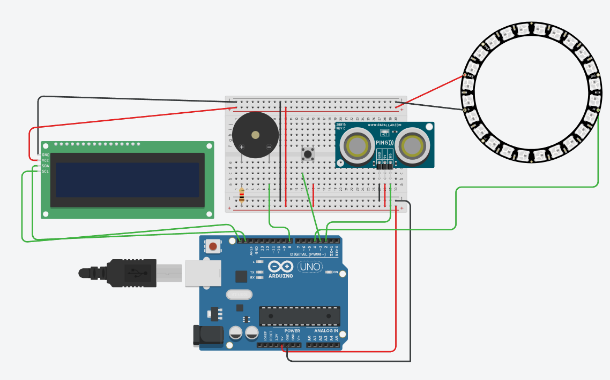

# Arduino_Instrument

# Japanese
## 概要
超音波距離センサの入力をもとに、音程、NeoPixel、LCD表示を連動させるArduinoスケッチです。
見た目と音の変化を組み合わせ、簡易的な楽器のように操作できる構成にしています。

## 使用技術
- 言語: Arduino C++
- ライブラリ/フレームワーク: Adafruit NeoPixel, Adafruit LiquidCrystal
- その他: Arduino IDE, 超音波距離センサ, 圧電スピーカー, NeoPixel LED, LCD

## 使い方
### 前提条件
- Arduino IDE 2.x 以上
- 対応するArduinoボード
- 配線済みの超音波距離センサ、圧電スピーカー、NeoPixel、LCD
- Arduino IDE のライブラリマネージャーで以下を導入済みであること
	- Adafruit NeoPixel
	- Adafruit LiquidCrystal

### インストール方法
```bash
git clone https://github.com/rainbow0210/Arduino_Instrument.git
cd Arduino_Instrument
```

その後、Arduino IDE で [Arduino_Instrument.ino](Arduino_Instrument.ino) を開いてください。

### 基本的な使い方
1. Arduino IDE で [Arduino_Instrument.ino](Arduino_Instrument.ino) を開きます。
2. 使用するボードとポートを選択します。
3. 必要なライブラリを導入します。
4. スケッチを書き込みます。
5. 超音波センサに手や物体を近づけると、距離に応じて音程、NeoPixel、LCD表示が変化します。

## 主な機能
- 超音波距離センサの値に応じて音程を変化させる
- 圧電スピーカーで音を鳴らす
- 距離に応じてNeoPixelの点灯数と色を変える
- LCDに音名を表示する
- Serial Monitor に距離と音程の値を出力する

## 設定
スケッチ内のピン定義と表示範囲を変更することで、接続機器や反応範囲を調整できます。

- NeoPixel: `PIN 4`, `NUMPIXELS 24`
- 超音波センサ: D2
- 押しボタン: D3
- 圧電スピーカー: D8
- 距離から音程への変換範囲: 37 〜 309

配線を変更した場合は、[Arduino_Instrument.ino](Arduino_Instrument.ino) 内の `PIN`、`NUMPIXELS`、`pinMode`、`tone`、`pulseIn` の対象ピンを合わせてください。

## APIリファレンス / ドキュメント
外部APIは使用していません。
実装の中心は [Arduino_Instrument.ino](Arduino_Instrument.ino) です。
主な処理は以下の通りです。

- `setup()`: NeoPixel、LCD、Serial を初期化する
- `loop()`: 距離計測、音程変換、NeoPixel制御、LCD表示を繰り返す

関連ライブラリの情報は以下を参照してください。
- Adafruit NeoPixel
- Adafruit LiquidCrystal
- Arduino IDE ドキュメント


## image


# English
## Overview
This Arduino sketch links an ultrasonic distance sensor to sound, NeoPixel output, and LCD text.
It is designed as a simple instrument-like experience where motion changes both the sound and the visual feedback.

## Technologies
- Language: Arduino C++
- Libraries/Frameworks: Adafruit NeoPixel, Adafruit LiquidCrystal
- Other: Arduino IDE, ultrasonic distance sensor, piezo speaker, NeoPixel LEDs, LCD

## Usage
### Prerequisites
- Arduino IDE 2.x or later
- A compatible Arduino board
- A wired ultrasonic distance sensor, piezo speaker, NeoPixel strip or ring, and LCD
- The following libraries installed through the Arduino IDE Library Manager
  - Adafruit NeoPixel
  - Adafruit LiquidCrystal

### Installation
```bash
git clone https://github.com/rainbow0210/Arduino_Instrument.git
cd Arduino_Instrument
```

Then open [Arduino_Instrument.ino](Arduino_Instrument.ino) in the Arduino IDE.

### Basic Usage
1. Open [Arduino_Instrument.ino](Arduino_Instrument.ino) in the Arduino IDE.
2. Select the board and port you are using.
3. Install the required libraries.
4. Upload the sketch to your board.
5. Move your hand or an object in front of the ultrasonic sensor to change the pitch, NeoPixel display, and LCD output.

## Main Features
- Changes the pitch according to the ultrasonic distance sensor value
- Plays sound through a piezo speaker
- Changes NeoPixel brightness, color, and lit count based on distance
- Displays the note name on the LCD
- Prints distance and pitch values to the Serial Monitor

## Configuration
You can adjust the connected hardware and response range by changing the pin definitions and mapping values in the sketch.

- NeoPixel: `PIN 4`, `NUMPIXELS 24`
- Ultrasonic sensor: D2
- Push button: D3
- Piezo speaker: D8
- Distance-to-pitch mapping range: 37 to 309

If you change the wiring, update the target pins used by `PIN`, `NUMPIXELS`, `pinMode`, `tone`, and `pulseIn` in [Arduino_Instrument.ino](Arduino_Instrument.ino).

## API Reference / Documentation
No external API is used.
The core implementation is in [Arduino_Instrument.ino](Arduino_Instrument.ino).
The main flow is as follows.

- `setup()`: initializes NeoPixel, LCD, and Serial
- `loop()`: repeatedly measures distance, converts it to pitch, controls NeoPixel output, and updates the LCD

Refer to the following resources for library and platform details.
- Adafruit NeoPixel
- Adafruit LiquidCrystal
- Arduino IDE documentation

## Image

